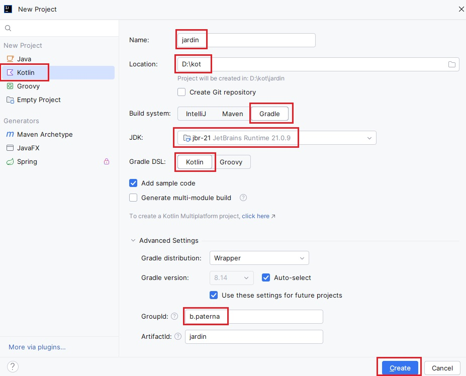
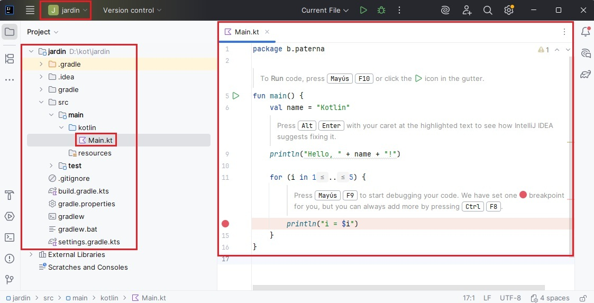

# 1. Introducción y entorno de desarrollo


<span class="mi_h3">Revisiones</span>

| Revisión | Fecha      | Descripción                             |
|----------|------------|-----------------------------------------|
| 1.0      | 29-06-2026 | Adaptación de los materiales a markdown |


## 1.1. Instalación de IntelliJ IDEA Community

Para el desarrollo de nuestras aplicaciones utilizaremos el Entorno de Desarrollo Integrado (IDE) **IntelliJ IDEA**. Para la creación de estos apuntes se ha utilizado la versión **2025.2.6.2 Community Edition**.

<span class="mi_h3">Instalación en los ordenadores de clase</span>

Para instalar IntelliJ en el ordenador del aula, sigue estos pasos:

1. **Descargar los archivos:** Accede a la web oficial [https://www.jetbrains.com/idea/download/other/](https://www.jetbrains.com/idea/download/other/) y busca la versión 2025.2.6.2 Community Edition para Linux, luego descarga el archivo `.tar.gz`.
2. **Descomprimir y ubicar:** Extrae el archivo descargado (que habitualmente se guarda en la carpeta `Descargas`) y mueve la carpeta resultante a tu directorio de usuario (fuera de la carpeta temporal de descargas).
3. **Configurar permisos de ejecución:**
    * Navega hasta la carpeta `bin` dentro del directorio extraído.
    * Localiza el archivo ejecutable `idea.sh`.
    * Haz clic derecho sobre él, selecciona **Propiedades > Permisos** y asegúrate de que la opción **Permitir ejecutar el archivo como un programa** (o *Permet executar*) esté marcada.
    * Ejecuta el archivo desde la terminal o haciendo doble clic sobre él.

<span class="mi_h3">Instalación en Windows</span>

Para realizar la instalación en tu equipo personal con Windows:

1. **Descargar el instalador:** Accede a la web oficial [https://www.jetbrains.com/idea/download/other/](https://www.jetbrains.com/idea/download/other/) y busca la versión 2025.2.6.2 Community Edition para Windows, luego descarga el archivo `.exe`.
2. **Asistente de instalación:** Ejecuta el instalador descargado y sigue los pasos indicados en pantalla:
    * **Directorio de destino:** Por defecto se instalará en `C:\Program Files\JetBrains\...` (requiere aproximadamente 3.2 GB de espacio en disco).
    * **Opciones de instalación:** Se recomienda marcar la opción para crear un acceso directo en el escritorio y, opcionalmente, asociar las extensiones de archivo `.kt` (Kotlin).
    * **Menú Inicio:** Selecciona la carpeta de destino del menú (por defecto *JetBrains*) y pulsa **Install**.
3. **Primer inicio:** Al abrir la aplicación por primera vez, acepta los términos de uso y elige si deseas importar configuraciones previas en caso de que ya tuvieras otra versión instalada.


## 1.2. Gestión y configuración de proyectos

<span class="mi_h3">Organización del espacio de trabajo</span>

Antes de empezar a crear programas, es importante que mantengas tu espacio de trabajo organizado. Es recomendable que crees una carpeta raíz en tu unidad de almacenamiento (por ejemplo, una carpeta llamada `kot` dentro de tu unidad de trabajo) donde guardar de forma ordenada los proyectos del curso.

> **Consejo de personalización:** Puedes cambiar la apariencia del entorno pulsando en el icono de la **rueda dentada (Ajustes)** en la esquina inferior izquierda de la pantalla de bienvenida. Para estas explicaciones utilizaremos el modo de color claro (*Light Mode*). 


<span class="mi_h3">Primer programa y su ejecución</span>

Antes de crear nuestro primer programa, es importante introducir un concepto clave: **Gradle**. Gradle es un sistema de gestión y construcción de proyectos (denominado build system) que nos permitirá estructurar el proyecto bajo un estándar profesional y nos facilitará la tarea de añadir librerías externas o dependencias sin tener que configurar todo manualmente. Aunque al principio realizaremos programas sencillos utilizaremos Gradle desde el primer día. 

Para crear tu primer proyecto en **Kotlin** con **Gradle**, abre IntelliJ IDEA y haz clic en **New Project** en la ventana de inicio, como se muestra en la siguiente imagen:


También puedes crear un proyecto nuevo desde el menú `File > New > Project`. Elijas el camino que elijas, en ambos casos aparecerá la ventana en la que configurar los parámetros de tu nuevo proyecto. Realiza lo siguiente:

* Marca **Kotlin** en la columna de la izquierda.
* **Name:** Indica el nombre de tu proyecto (en el caso del ejemplo es `jardin`)
* **Location:** Selecciona tu directorio de trabajo (por ejemplo, `D:\kot` o la ruta de tu carpeta de usuario).
* **Build system:** Selecciona **Gradle**.
* **JDK:** Selecciona la versión disponible de Java instalada en el sistema.
* **Gradle DSL:** Selecciona **Kotlin**.
* Marca la opción **Add sample code**.
* Indica tu inicial seguida de un punto y tu apellido en GroupId dentro de **Advance Settings:** (en el caso del ejemplo es `b.paterna`). 

Puedes ver toda esta información en la siguiente imagen:



Ua vez tengas todos los datos, haz clic en **Create** y espera a que IntelliJ prepare el entorno y sincronice Gradle por primera vez (este proceso puede tardar unos instantes). Cuando termine de preparar el proyecto se habrá creado la carpeta `jardin` dentro de la carpeta `kot` y dentro de `jardin` la estructura de carpetas siguiente:

* **`.idea` / `.gradle`**: Carpetas de configuración interna. No deben modificarse manualmente.
* **`build.gradle.kts`**: Es el archivo de configuración de Gradle. En él definiremos el comportamiento del proyecto y las librerías o dependencias externas que queramos descargar de forma automática.
* **`src/main/kotlin`**: Es el directorio raíz donde se almacena todo el código fuente de nuestra aplicación. Es la carpeta más importante del proyecto.
* **`Main.kt`**: Archivo autogenerado (gracias a la opción *Add sample code*) que contiene el punto de entrada de nuestro programa.


Puedes ver esta información en la siguiente imagen:




**Ejecución del programa**

Reemplaza el código autogenerado del archivo `Main.kt` con el siguiente código (que simula un sistema de riego de una planta):

```kotlin
fun main() {
    val planta = "Orquídea"
    println("¡Bienvenido al sistema de control botánico!")
    println("Planta seleccionada en el sistema: $planta")

    // Simulación del riego diario (5 días)
    for (dia in 1..5) {
        println("Día $dia: La planta '$planta' ha sido regada correctamente.")
    }
}
```


> **Ejecución del programa:** Para ejecutar el código escrito, haz clic en el icono verde de **Play** situado en el margen izquierdo de la función `main` (o en la barra de herramientas superior).

El resultado de la ejecución se mostrará inmediatamente en la consola y es el siguiente:

```text
¡Bienvenido al sistema de control botánico!
Planta seleccionada en el sistema: Orquídea
Día 1: La planta 'Orquídea' ha sido regada correctamente.
Día 2: La planta 'Orquídea' ha sido regada correctamente.
Día 3: La planta 'Orquídea' ha sido regada correctamente.
Día 4: La planta 'Orquídea' ha sido regada correctamente.
Día 5: La planta 'Orquídea' ha sido regada correctamente.

Process finished with exit code 0
```

Si necesitas crear una clase o un nuevo archivo de Kotlin en el futuro sigue estos pasos:

* Haz clic derecho sobre la carpeta donde quieras crear el nuevo archivo.
* Selecciona **New > Kotlin File/Class**.
* Escribe el nombre para el archivo y selecciona el tipo (*File*, *Class*, *Interface*, etc.).


<span class="mi_h3">Compartir y entregar proyectos</span>

Cuando debas entregar una tarea de programación o compartir un proyecto con el profesor, evita subir archivos sueltos. El procedimiento correcto se realiza desde el explorador de archivos de tu sistema operativo:

1. Cierra el IDE IntelliJ IDEA para asegurarte de que no haya procesos de escritura activos.
2. Localiza la carpeta de tu proyecto (por ejemplo, la carpeta `jardin` que se encuentra dentro de tu espacio de trabajo `kot`).
3. Comprime la carpeta del proyecto en un único archivo comprimido:
    * **En Windows:** Haz clic derecho sobre la carpeta del proyecto y haz clic en  **Enviar a carpeta comprimida (en zip)**.
    * **En Ubuntu:** Haz clic derecho sobre la carpeta y haz clic en **Comprimir... Seleccionar formato .zip**.
4. Envía o sube a la plataforma del aula el archivo `.zip` resultante.


## 1.3. Organización del código (Packages e Imports)

A medida que nuestros programas crecen, escribir todo el código en un único archivo (`Main.kt`) se vuelve difícil de mantener y de leer. En proyectos reales, el código se divide en diferentes archivos y carpetas. Para entender cómo se comunican estos archivos entre sí, primero veremos un proyecto completo distribuido en varias carpetas y luego explicaremos detalladamente cada uno de los conceptos que lo hacen posible.


<span class="mi_h3">Ejemplo: asistente de control de riego</span>

Imagina que estamos desarrollando un asistente para controlar el riego y la humedad de un invernadero. En lugar de tener un solo archivo, hemos estructurado nuestro proyecto de Gradle en tres carpetas (*paquetes*): **`modelo`**, **`util`** y **`app`**. La estructura de archivos en el panel izquierdo de IntelliJ se ve así:

```text
control_botanico/
└── src/
    └── main/
        └── kotlin/
            ├── app/
            │   └── Main.kt           <-- Coordinador de la aplicación
            ├── modelo/
            │   └── Planta.kt         <-- Define qué es una planta
            └── util/
                └── AsistenteRiego.kt <-- Lógica de cálculo y ayuda
```

A continuación, se muestra el código de cada uno de los tres archivos:

**Archivo 1: `src/main/kotlin/modelo/Planta.kt`.** Este archivo define la estructura de datos básica de nuestras plantas.

```kotlin
package modelo

data class Planta(val especie: String, val humedadIdeal: Int)
```

**Archivo 2: `src/main/kotlin/util/AsistenteRiego.kt`.** Este archivo contiene la lógica de cálculo para evaluar si una planta necesita agua o no.

```kotlin
package util

fun evaluarHumedad(actual: Int, ideal: Int): String {
    return when {
        actual < ideal - 15 -> "Urgente: Requiere riego inmediato."
        actual > ideal + 15 -> "Atención: Suelo encharcado, suspender el riego."
        else -> "Humedad adecuada."
    }
}

fun bienvenida(nombreJardinero: String): String {
    return "¡Hola, $nombreJardinero! Iniciando asistente de control..."
}
```

**Archivo 3: `src/main/kotlin/app/Main.kt`.** Este es el archivo principal que coordina el programa. Para poder usar lo que hemos programado en los otros archivos, tenemos que "traerlo" (importarlo) aquí.

```kotlin
package app

// 1. Importamos la plantilla 'Planta' desde el paquete modelo
import modelo.Planta

// 2. Importamos la función de diagnóstico desde el paquete util
import util.evaluarHumedad

// 3. Importamos la función de bienvenida y le damos un "apodo" o alias
import util.bienvenida as saludar

fun main() {
    // Usamos la función de bienvenida mediante su alias
    println(saludar("Pol"))
    println("----------------------------------------")
    
    // Creamos un objeto Planta
    val miHelecho = Planta("Helecho real", 75)
    
    // Simulamos la lectura de humedad de un sensor (al 50%)
    val lecturaSensor = 50
    val diagnostico = evaluarHumedad(lecturaSensor, miHelecho.humedadIdeal)
    
    // Mostramos los resultados
    println("Planta: ${miHelecho.especie}")
    println("Humedad registrada: $lecturaSensor% (Humedad objetivo: ${miHelecho.humedadIdeal}%)")
    println("Diagnóstico del sistema: $diagnostico")
}
```

Salida por consola al ejecutar `Main.kt`:

```text
¡Hola, Pol! Iniciando asistente de control...
----------------------------------------
Planta: Helecho real
Humedad registrada: 50% (Humedad objetivo: 75%)
Diagnóstico del sistema: Urgente: Requiere riego inmediato.
```


<span class="mi_h3">Explicación del ejemplo</span>   


**¿Qué es un `package` (Paquete)?**

Si observas la primera línea de cada uno de los tres archivos anteriores, verás la palabra reservada `package` (`package modelo`, `package util`, `package app`). Un **package (paquete)** es un contenedor lógico y físico (una carpeta) que sirve para organizar y agrupar archivos relacionados y así evitar conflictos de nombres. Por ejemplo, podrías tener una función llamada `guardar()` en un paquete de base de datos y otra función `guardar()` en un paquete de interfaz gráfica sin que el compilador se confunda.

> **Reglas clave de los paquetes:**
> 
>   * La declaración `package` debe ser **la primera línea de código** de tu archivo.
>   * Por convención, los nombres de los paquetes se escriben siempre en **minúsculas**.
>   * Si los paquetes tienen varios niveles (subcarpetas), en el código los separamos por un punto. *Por ejemplo:* Si dentro de la carpeta `modelo` decidiéramos crear una subcarpeta llamada `tipos` para organizar mejor las plantas, la ruta física sería `modelo/tipos/` y en el código escribiríamos:
>       ```kotlin
>       package modelo.tipos
>       ```


**¿Qué es un `import` (Importación)?**

Por defecto, un archivo de Kotlin no puede ver lo que hay dentro de carpetas o paquetes distintos al suyo. Para solucionar esto y conectar los archivos de nuestro ejemplo, utilizamos la palabra clave `import`. Un **import (importación)** le dice al compilador dónde encontrar una clase, función o variable que reside en otro paquete para poder usarla en el archivo actual.

* En `Main.kt` (que pertenece al paquete `app`), usamos `import modelo.Planta` para poder declarar una variable de tipo `Planta`.


A veces importamos herramientas que tienen nombres muy largos o que coinciden con el nombre de otra función del proyecto. Para evitar conflictos, podemos renombrarlas temporalmente (darles un alias) con la palabra `as`.

* *En nuestro ejemplo:* `import util.bienvenida as saludar` nos permite llamar a la función escribiendo simplemente `saludar("Pol")`.

Si el paquete `util` tuviera 20 funciones diferentes y quisiéramos usarlas todas en `Main.kt`, escribir 20 líneas de importación sería molesto. Podemos importar absolutamente todo lo que contenga un paquete utilizando un asterisco:

  ```kotlin
  import util.* // Trae todas las funciones y clases públicas de 'util'
  ```


<span class="mi_h3">Tabla resumen de organización</span>

| Palabra clave | ¿Qué hace? | Ejemplo en el proyecto |
| :--- | :--- | :--- |
| **`package`** | Define el espacio lógico y la carpeta en la que se encuentra el archivo actual. | `package modelo` |
| **`import`** | Trae una herramienta específica (clase o función) de otro paquete para poder utilizarla. | `import modelo.Planta` |
| **`import ... as`** | Trae una herramienta y le asigna un nombre temporal (alias) para facilitar su uso o evitar conflictos. | `import util.bienvenida as saludar` |
| **`import ... *`** | Importa todos los elementos públicos de un paquete de golpe. | `import util.*` |


---
<span class="mi_h3">Autoría</span>

<span class="mi_autoria">
Obra realizada por Begoña Paterna Lluch. Publicada bajo licencia [Creative Commons Atribución/Reconocimiento-CompartirIgual 4.0 Internacional](https://creativecommons.org/licenses/by-sa/4.0/)
</span>
---